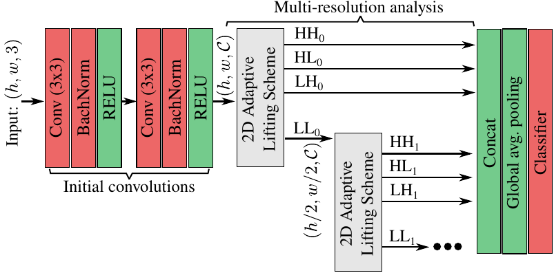

# A PyTorch Implementation for "Deep Adaptive Wavelet Network" 



This repository contains a [PyTorch](http://pytorch.org/) implementation of the paper [Deep Adaptive Wavelet Network](https://arxiv.org/abs/1912.05035). The code is based on the excellent [PyTorch example for training ResNet on Imagenet](https://github.com/pytorch/examples/tree/master/imagenet). 

However, the code contains several major modifications like more models and databases. CIFAR databases are provided by pytorch default implementation. For KTH database, you first need to install the files on your machine, [KTH-TIPS](https://www.nada.kth.se/cvap/databases/kth-tips/). 

The networks definition provided by this code are:

- Deep Adaptive Wavelet (DAWN)
- Texture-CNN (TCNN) [1]
- Wavelet CNN [2]
- Scatter networks [3]
- [Densenet](https://github.com/bamos/densenet.pytorch) [4]
- Resnet [5]
- VGG (variation using BN) [6]

Each of these networks can be selected using the network name inside the command line and changing its hyperparameters. Almost all the networks can be trained on the different databases supported in this code.

This is an example to train DAWN on CIFAR-100 with 128 initial convolutions. 
```sh
$ python train.py --epochs 300 -b 64 --lr 0.03 --name dwnn_cifar-100_32 --lrdecay 150 225 --database cifar-100 --tempdir ~/tmp  dawn --regu_detail 0.1 --regu_approx 0.1 --levels 3 --first_conv 128
```
This is another example for KTH database with DAWN:
```sh
$ python train.py --epochs 90 -b 16 --lr 0.03 --name dwnn_kth_3_dwnn_l5_16 --lrdecay 30 60 --database kth --traindir $KTH_DATA_DIR/KTH-TIPS2-b3/Test/ --valdir $KTH_DATA_DIR/KTH-TIPS2-b3/Train/ dwnn --levels 5 --first_conv 16 --regu_details 0.1 --regu_approx 0.1
```

### Cite
If you use DWNN in your work, please cite the original paper as:
```
@misc{Bastidas2019deep,
    title={Deep Adaptive Wavelet Network},
    author={Maria Ximena Bastidas Rodriguez and Adrien Gruson and Luisa F. Polania and Shin Fujieda and Flavio Prieto Ortiz and Kohei Takayama and Toshiya Hachisuka},
    year={2019},
    eprint={1912.05035},
    archivePrefix={arXiv},
    primaryClass={cs.CV}
}
```
This is the arvix link for now. This Readme will be updated when the WACV paper will be released.

### TODO

- Add script to regenerate all results shown inside the paper

### References 

[1] P.  F.  W.  Vincent  Andrearczyk. "Using  filter  banks  in convolutional   neural   networks   for   texture   classification." (arXiv:1601.02919, 2016)\
[2] Fujieda et al. "Wavelet convolutional neural networks." (arXiv:1805.08620
, 2018)\
[3] Oyallon et al. "Scaling the scattering transform: Deep hybrid networks" (ICCV, 2017)\
[4] Huang et al. "Densely connected convolutional networks." (arXiv:1608.06993, 2016)\
[5] He et al. "Deep Residual Learning for Image Recognition." (arXiv:1512.03385, 2015) \
[6] http://torch.ch/blog/2015/07/30/cifar.html
